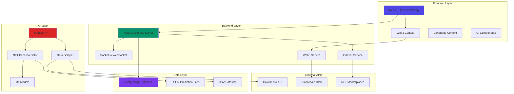
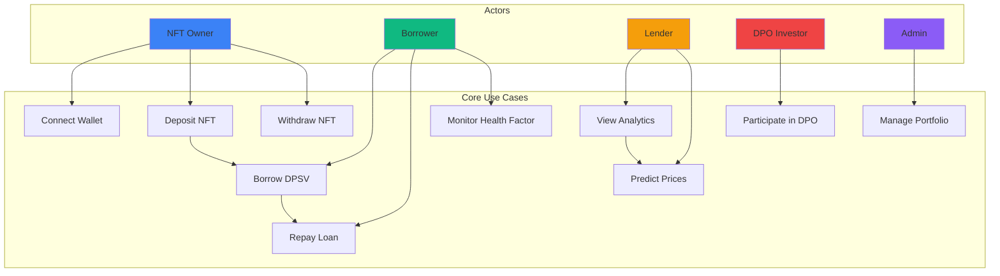
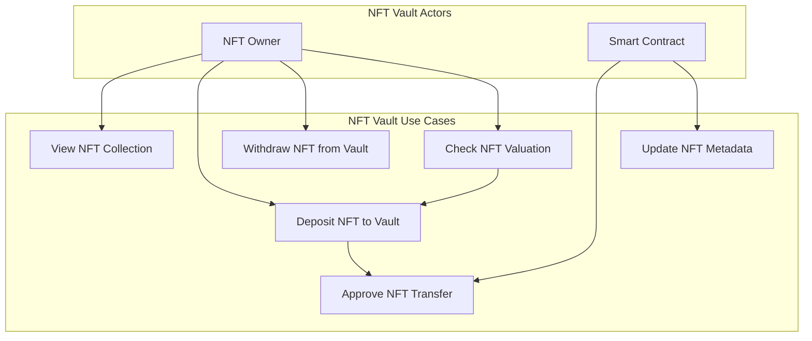
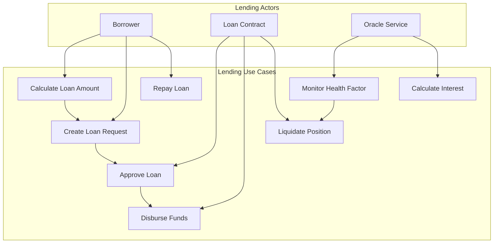
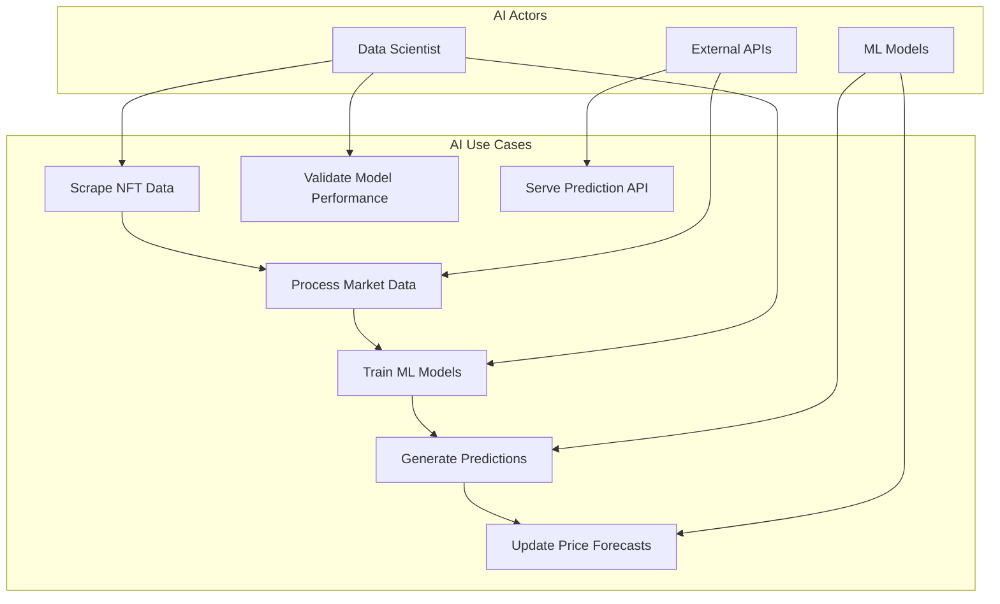
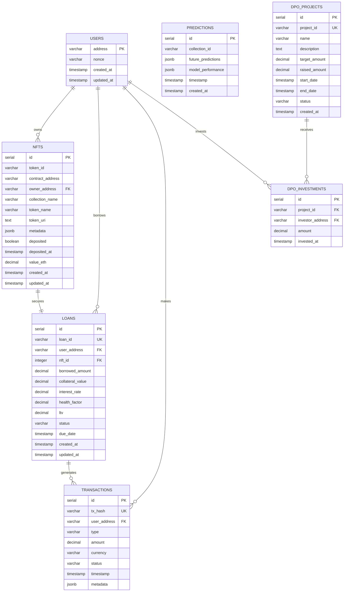
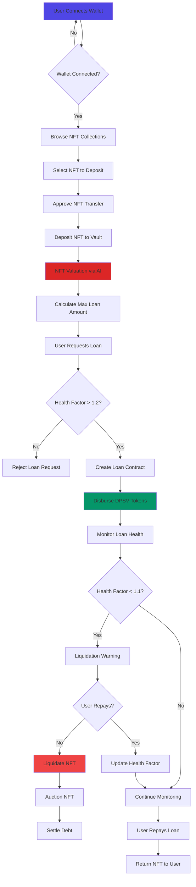
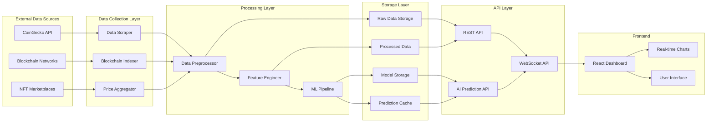

# 🎨 Mosaical - NFT Lending Platform

## 📋 Overview

Mosaical is a decentralized NFT lending platform that allows users to use their NFTs as collateral to borrow DPSV tokens. The platform integrates AI-powered price prediction, real-time analytics, and DPO (Decentralized Public Offering) features.

## ✨ Features

- **NFT Vault Management**: Deposit and manage NFT collections as collateral
- **Lending & Borrowing**: Borrow DPSV tokens against NFT collateral
- **AI Price Prediction**: Machine learning models for NFT price forecasting
- **Real-time Analytics**: Market data visualization and portfolio tracking
- **DPO Panel**: Decentralized public offering management
- **Multi-language Support**: English and Vietnamese language support
- **Web3 Integration**: MetaMask and wallet connectivity

## 🏗️ System Architecture



## 🎯 Use Case Diagram - Overall System



## 🏛️ Module Use Case Diagrams

### NFT Vault Module



### Lending Module



### AI Prediction Module



## 🎨 Class Diagram

```mermaid
classDiagram
    class User {
        +String address
        +String nonce
        +Date createdAt
        +Date updatedAt
        +connectWallet()
        +signMessage()
        +authenticate()
    }
    
    class NFT {
        +String tokenId
        +String contractAddress
        +String ownerAddress
        +String collectionName
        +String tokenName
        +String tokenUri
        +Object metadata
        +Boolean deposited
        +Number valueEth
        +deposit()
        +withdraw()
        +updateValue()
    }
    
    class Loan {
        +String loanId
        +String userAddress
        +Number nftId
        +Number borrowedAmount
        +Number collateralValue
        +Number interestRate
        +Number healthFactor
        +Number ltv
        +Date createdAt
        +createLoan()
        +repayLoan()
        +liquidate()
        +calculateHealthFactor()
    }
    
    class Prediction {
        +String collectionId
        +Array futurePredictons
        +Object modelPerformance
        +Date timestamp
        +generatePrediction()
        +updateModel()
        +validateAccuracy()
    }
    
    class Transaction {
        +String txHash
        +String userAddress
        +String type
        +Number amount
        +String status
        +Date timestamp
        +processTransaction()
        +validateTransaction()
        +updateStatus()
    }
    
    class DPOProject {
        +String projectId
        +String name
        +String description
        +Number targetAmount
        +Number raisedAmount
        +Date startDate
        +Date endDate
        +String status
        +createProject()
        +invest()
        +closeProject()
    }
    
    User ||--o{ NFT : owns
    User ||--o{ Loan : borrows
    User ||--o{ Transaction : makes
    User ||--o{ DPOProject : invests
    NFT ||--|| Loan : collateralizes
    Loan ||--o{ Transaction : generates
    Prediction ||--o{ NFT : predicts
```

## 🗃️ Entity Relationship Diagram



## 🔄 Functional Flow Diagram



## 📊 Data Flow Diagram



## 🏃‍♂️ Getting Started

### Prerequisites

- Node.js 18+
- Python 3.11+
- PostgreSQL 16+
- Git

### Installation

1. **Clone the repository:**
```bash
git clone <repository-url>
cd mosaical-nft-lending
```

2. **Install frontend dependencies:**
```bash
npm install
```

3. **Install backend dependencies:**
```bash
cd backend
npm install
cd ..
```

4. **Install AI dependencies:**
```bash
cd ai
pip install -r requirements.txt
cd ..
```

5. **Setup environment variables:**
```bash
cp backend/.env.example backend/.env
# Edit backend/.env with your configuration
```

6. **Setup database:**
```bash
cd backend
npm run migrate
cd ..
```

### Running the Application

**Development Mode (Full Stack + AI):**
```bash
npm run dev
```

This will start:
- Frontend on port 3001
- Backend API on port 3001
- AI API on port 5000

## 🚀 Deployment

The application is configured for Replit deployment:

1. **Build the application:**
```bash
npm run build
```

2. **Deploy via Replit:**
- Click the "Deploy" button in Replit
- Configure environment variables
- Deploy to autoscale

## 📁 Project Structure

```
mosaical-nft-lending/
├── src/                    # Frontend React application
│   ├── components/         # Reusable UI components
│   ├── contexts/          # React contexts (Web3, Language)
│   ├── pages/             # Main application pages
│   └── lib/               # Utility functions
├── backend/               # Node.js backend API
│   ├── routes/            # API route handlers
│   ├── services/          # Business logic services
│   ├── config/            # Configuration files
│   └── utils/             # Backend utilities
├── ai/                    # Python AI/ML services
│   ├── datasets/          # Training data
│   ├── models/            # Trained ML models
│   └── predictions/       # Generated predictions
└── docs/                  # Documentation
```

## 🔧 API Endpoints

### Authentication
- `POST /api/auth/login` - Web3 authentication
- `POST /api/auth/nonce` - Get nonce for signing

### User Management
- `GET /api/user/profile` - Get user profile
- `PUT /api/user/profile` - Update user profile
- `GET /api/user/balance` - Get DPSV balance

### NFT Operations
- `GET /api/nfts` - List user NFTs
- `POST /api/nfts/deposit` - Deposit NFT
- `POST /api/nfts/withdraw` - Withdraw NFT
- `GET /api/nfts/valuation/:id` - Get NFT valuation

### Lending
- `POST /api/loans/create` - Create new loan
- `GET /api/loans` - List user loans
- `POST /api/loans/repay` - Repay loan
- `GET /api/loans/health/:id` - Check health factor

### Analytics
- `GET /api/analytics/dashboard` - Dashboard metrics
- `GET /api/analytics/portfolio` - Portfolio analytics
- `GET /api/analytics/market` - Market data

### AI Predictions
- `GET /api/predictions/:collection` - Get price predictions
- `GET /api/predictions/all` - Get all predictions
- `POST /api/predictions/refresh` - Refresh predictions

## 🧪 Testing

```bash
# Run frontend tests
npm test

# Run backend tests
cd backend
npm test

# Run AI model tests
cd ai
python -m pytest tests/
```

## 📋 TODO List

### ✅ Completed Features
- [x] Basic React frontend with TypeScript
- [x] Web3 wallet integration (MetaMask)
- [x] Multi-language support (EN/VI)
- [x] NFT vault interface
- [x] Loan management interface
- [x] AI price prediction integration
- [x] Real-time analytics dashboard
- [x] DPO panel interface
- [x] Backend API with Express.js
- [x] PostgreSQL database integration
- [x] AI/ML price prediction models
- [x] CoinGecko API integration
- [x] Socket.io for real-time updates
- [x] DPSV token conversion

### 🚧 In Progress
- [ ] Smart contract integration
- [ ] Blockchain transaction processing
- [ ] Advanced ML model optimization
- [ ] Mobile responsive design improvements

### 📅 Planned Features

#### Phase 1: Core Infrastructure
- [ ] Smart contract deployment on Saga
- [ ] Automated liquidation system
- [ ] Advanced portfolio analytics
- [ ] Mobile app development

#### Phase 2: Advanced Features
- [ ] Cross-chain NFT support
- [ ] Yield farming integration
- [ ] DAO governance implementation
- [ ] Advanced trading features

#### Phase 3: Enterprise Features
- [ ] Institutional lending
- [ ] Insurance protocol integration
- [ ] Advanced risk management
- [ ] Regulatory compliance tools

#### Phase 4: Ecosystem Expansion
- [ ] NFT marketplace integration
- [ ] DeFi protocol partnerships
- [ ] Layer 2 scaling solutions
- [ ] Cross-platform compatibility

### 🐛 Known Issues
- [ ] Price prediction accuracy needs improvement
- [ ] UI responsiveness on mobile devices
- [ ] Socket.io connection stability
- [ ] Database query optimization needed

### 🔧 Technical Improvements
- [ ] Add comprehensive error handling
- [ ] Implement rate limiting
- [ ] Add API documentation with Swagger
- [ ] Improve test coverage (target: 80%+)
- [ ] Add performance monitoring
- [ ] Implement caching strategy
- [ ] Add CI/CD pipeline
- [ ] Security audit and penetration testing

### 🎨 UI/UX Improvements
- [ ] Dark/light theme toggle
- [ ] Improved loading states
- [ ] Better error messages
- [ ] Accessibility improvements
- [ ] Animation and micro-interactions
- [ ] Mobile-first responsive design

## 🤝 Contributing

1. Fork the repository
2. Create your feature branch (`git checkout -b feature/AmazingFeature`)
3. Commit your changes (`git commit -m 'Add some AmazingFeature'`)
4. Push to the branch (`git push origin feature/AmazingFeature`)
5. Open a Pull Request

## 📄 License

This project is licensed under the MIT License - see the [LICENSE](LICENSE) file for details.

## 🆘 Support

For support and questions:
- Create an issue on GitHub
- Join our Discord community
- Email: support@mosaical.io

## 🙏 Acknowledgments

- CoinGecko for NFT market data
- Saga blockchain for infrastructure
- OpenZeppelin for smart contract standards
- React and TypeScript communities

---

Built with ❤️ by the Mosaical Team
